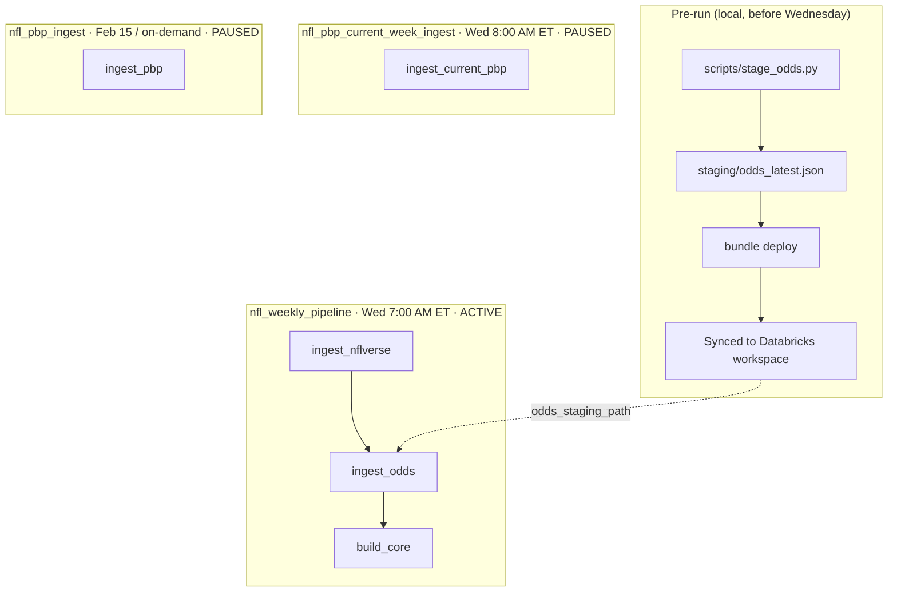
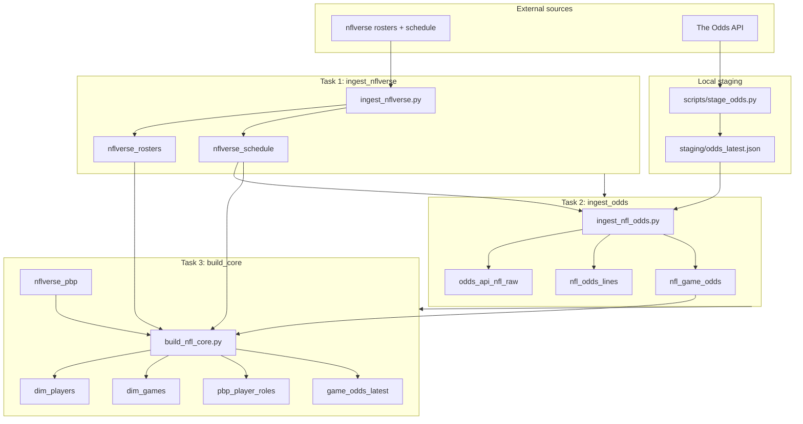
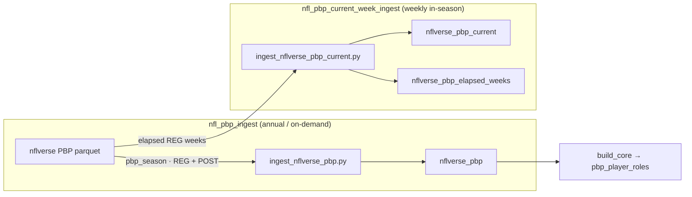

# NFL Odds Databricks

VS Code project that ingests NFL betting odds, nflverse reference data, and play-by-play into Unity Catalog Delta tables on Databricks serverless compute.

Data is keyed on official identifiers (`game_id`, `gsis_id`) to avoid team-name and player-name collisions.

## What it does

| Source | Data |
|--------|------|
| [The Odds API](https://the-odds-api.com/) | Upcoming regular-season moneyline, spread, and total |
| [nflverse](https://github.com/nflverse/nfldata) | Schedule, rosters, play-by-play |
| Internal transforms | `dim_games`, `dim_players`, latest odds per `game_id` |

Odds are joined to nflverse `game_id` (e.g. `2026_01_NE_SEA`) using away/home teams and kickoff date (ET).

## Project layout

```
nfl-odds-databricks/
├── databricks.yml              # Asset Bundle config and variables
├── resources/                  # Job definitions
├── notebooks/                  # Databricks ingest notebooks
├── src/nfl_odds/               # Shared Python package
├── scripts/                    # Local fetch/stage helpers
├── staging/                    # Staged odds JSON for serverless ingest
└── output/                     # Local CSV/parquet outputs
```

## Jobs (3)

| Job | Schedule | Purpose |
|-----|----------|---------|
| `nfl_weekly_pipeline` | **Wed 7:00 AM ET** (active) | Rosters + schedule → staged odds → dimension tables |
| `nfl_pbp_current_week_ingest` | Wed 8:00 AM ET (paused) | In-season PBP for completed REG weeks |
| `nfl_pbp_ingest` | Annual / on-demand (paused) | Full prior-season PBP (REG + POST) |

## Workflows

### Job overview



### Weekly pipeline (tasks + tables)



Odds join to official `game_id` via away/home teams and kickoff date (ET) against `nflverse_schedule`.

### Play-by-play jobs



`nflverse_pbp` is loaded once per completed season; `nflverse_pbp_current` refreshes elapsed in-season weeks. The current-week job exits cleanly when no weeks have finished.

### Weekly pipeline tasks

1. `ingest_nflverse` — rosters and schedule
2. `ingest_odds` — reads staged odds file, writes odds tables with `game_id`
3. `build_core` — builds `dim_players`, `dim_games`, `pbp_player_roles`, `game_odds_latest`

## Delta tables (`<catalog>.nfl`)

| Table | Description |
|-------|-------------|
| `nflverse_schedule` | Regular-season schedule with `game_id` |
| `nflverse_rosters` | Current rosters |
| `nflverse_pbp` | Full prior-season play-by-play |
| `nflverse_pbp_current` | Current-season elapsed-week play-by-play |
| `nflverse_pbp_elapsed_weeks` | Metadata for which weeks were loaded |
| `odds_api_nfl_raw` | Raw odds API JSON payloads |
| `nfl_odds_lines` | Long-format odds (all bookmakers) |
| `nfl_game_odds` | Wide-format odds with `game_id` |
| `dim_players` | One row per player (`gsis_id` key) |
| `dim_games` | One row per game (`game_id` key) |
| `pbp_player_roles` | PBP player references by `player_id`, not name |
| `game_odds_latest` | Latest odds per `game_id` and bookmaker |

## Prerequisites

- Python 3.10+
- [Databricks CLI](https://docs.databricks.com/dev-tools/cli/) authenticated to your workspace
- [Databricks VS Code extension](https://docs.databricks.com/dev-tools/vscode-ext/)
- `odds_api_key` environment variable (local use)
- Databricks secret scope `nfl` with key `odds_api_key`

### Local setup

```powershell
cd nfl-odds-databricks
python -m venv .venv
.\.venv\Scripts\pip install -e ".[dev]"
```

Open `nfl-odds-databricks.code-workspace` in VS Code. Select the `.venv` interpreter and authenticate the Databricks extension with profile `{YOUR_PROFILE}`.

### Databricks secret

```powershell
databricks secrets create-scope nfl --profile {YOUR_PROFILE}
databricks secrets put-secret nfl odds_api_key --profile {YOUR_PROFILE} --string-value YOUR_KEY
```

## Deploy and run

```powershell
.\.venv\Scripts\python -m build --wheel -o dist
databricks bundle deploy -t dev --profile {YOUR_PROFILE}
databricks bundle run nfl_weekly_pipeline -t dev --profile {YOUR_PROFILE}
```

## Weekly odds workflow (required)

Serverless jobs cannot reach The Odds API directly in this workspace. Stage odds locally before each Wednesday run:

```powershell
.\.venv\Scripts\python scripts\stage_odds.py
databricks bundle deploy -t dev --profile {YOUR_PROFILE}
```

`stage_odds.py` fetches odds locally and copies them to `staging/odds_latest.json`, which the bundle syncs to Databricks.

## Bundle variables

Variables are defined in `databricks.yml` and passed to job notebooks as parameters.

| Variable | Used by | Meaning |
|----------|---------|---------|
| `catalog` | All jobs | Unity Catalog name (set in `targets.dev.variables`) |
| `schema` | All jobs | Schema name (`nfl`) |
| `season` | Weekly pipeline (odds) | Season year for odds + `game_id` matching |
| `roster_season` | Weekly pipeline | Roster file year |
| `schedule_season` | Weekly pipeline | Schedule file year |
| `pbp_season` | `nfl_pbp_ingest` | Prior completed season for full PBP load |
| `current_pbp_season` | `nfl_pbp_current_week_ingest` | Active in-season year for elapsed-week PBP |
| `secret_scope` | Weekly pipeline (odds) | Databricks secret scope for API key fallback |

### Where to change variables

**Option 1 — `databricks.yml` (recommended for permanent changes)**

Edit defaults under `variables:` or per-target overrides under `targets.dev.variables:`.

**Option 2 — VS Code Bundle Variables panel**

Override values in the Databricks extension without editing YAML. Saved to `.databricks/bundle/dev/vscode.bundlevars.json`.

**Option 3 — CLI at deploy time**

```powershell
databricks bundle deploy -t dev --profile {YOUR_PROFILE} --var season=2027
```

## Season transition guide

When moving from one NFL season to the next (e.g. 2026 → 2027), update variables in this order.

### Example: transitioning after the 2026 season ends

| Variable | Old | New | Why |
|----------|-----|-----|-----|
| `season` | `2026` | `2027` | Odds and `game_id` matching target the new season |
| `roster_season` | `2026` | `2027` | Current rosters |
| `schedule_season` | `2026` | `2027` | New regular-season schedule |
| `current_pbp_season` | `2026` | `2027` | Elapsed-week PBP tracks the active season |
| `pbp_season` | `2025` | `2026` | Archive the just-completed season into full PBP |

### `databricks.yml` snippet (2027 kickoff)

```yaml
variables:
  season: "2027"
  roster_season: "2027"
  schedule_season: "2027"
  current_pbp_season: "2027"
  pbp_season: "2026"
```

Then deploy:

```powershell
databricks bundle deploy -t dev --profile {YOUR_PROFILE}
```

### Season transition checklist

1. **Update bundle variables** in `databricks.yml` (or VS Code Bundle Variables).
2. **Deploy** the bundle so jobs pick up new parameters.
3. **Run `nfl_pbp_ingest` once** to load the completed prior season (REG + POST) into `nflverse_pbp`.
4. **Unpause `nfl_pbp_current_week_ingest`** when the new regular season starts (Wed 8 AM ET).
5. **Keep `nfl_weekly_pipeline` active** — continue staging odds locally each Wednesday before deploy.
6. **Pause `nfl_pbp_current_week_ingest`** after the season ends (or leave it paused in the offseason; it exits cleanly when no weeks have elapsed).

### During the season

| When | Action |
|------|--------|
| Every Wednesday morning | `scripts/stage_odds.py` → `bundle deploy` → weekly pipeline runs at 7 AM |
| After games finish each week | `nfl_pbp_current_week_ingest` at 8 AM loads elapsed REG weeks |
| After season ends | Run `nfl_pbp_ingest` with updated `pbp_season`, pause current-week job |

### Offseason

- `nfl_weekly_pipeline` can stay active for early futures odds (if The Odds API lists them).
- `nfl_pbp_current_week_ingest` exits with "No elapsed weeks yet" — safe to leave paused.
- No changes needed to `pbp_season` until the season fully completes.

## Local scripts

| Script | Purpose |
|--------|---------|
| `scripts/stage_odds.py` | Fetch odds + copy to `staging/odds_latest.json` |
| `scripts/run_local.py` | Local odds fetch and CSV output |
| `scripts/acquire_nflverse.py` | Local rosters + schedule |
| `scripts/acquire_pbp.py` | Local full prior-season PBP |
| `scripts/acquire_pbp_current.py` | Local elapsed-week PBP |
| `scripts/build_core_local.py` | Local dimension table output |

## Tests

```powershell
.\.venv\Scripts\pytest
```

## ID design notes

- **Games** are keyed by nflverse `game_id` (`{season}_{week}_{away}_{home}`), not team display names.
- **Players** are keyed by `gsis_id`. Duplicate names (e.g. two "Jaylon Jones") get disambiguated labels like `Jaylon Jones (CHI)`.
- **PBP player references** use `player_id` columns, not `player_name`.
- **Odds** are joined to `game_id` via schedule; `game_odds_latest` dedupes on `game_id`, not `odds_api_id`.