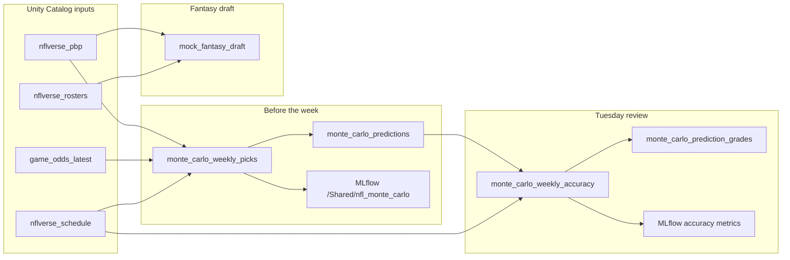

# PBP Analytics: Fantasy Draft & Monte Carlo Predictions

This guide covers the analytics notebooks built on top of the NFL odds pipeline. They use nflverse play-by-play (PBP) stats and current betting lines in Unity Catalog (`workspace.nfl` by default) to run a mock fantasy draft and simulate spread/total picks with tracked accuracy over time.

## Prerequisites

Before running these notebooks, ensure the base pipeline has loaded:

| Table | Required for |
|-------|----------------|
| `workspace.nfl.nflverse_pbp` | Team scoring profiles, fantasy rankings |
| `workspace.nfl.nflverse_rosters` | Player positions (fantasy draft) |
| `workspace.nfl.nflverse_schedule` | Week filtering, final scores (accuracy grading) |
| `workspace.nfl.game_odds_latest` | Spreads and totals (Monte Carlo picks) |

Typical setup:

1. Run `nfl_pbp_ingest` once to load prior-season PBP (e.g. `pbp_season=2025`).
2. Keep `nfl_weekly_pipeline` active — stage odds locally each Wednesday, deploy, and let the job refresh `game_odds_latest`.
3. Deploy the bundle so notebooks and the `nfl_odds` wheel are synced to Databricks.

```powershell
.\.venv\Scripts\python scripts\stage_odds.py
.\.venv\Scripts\python -m build --wheel -o dist
databricks bundle deploy -t dev --profile {YOUR_PROFILE}
```

## Notebooks

| Notebook | When to run | Purpose |
|----------|-------------|---------|
| `mock_fantasy_draft` | Anytime before your draft | 12-team snake draft using PBP fantasy rankings |
| `monte_carlo_weekly_picks` | Before games kick off | Simulate spreads/totals; log predictions |
| `monte_carlo_weekly_accuracy` | **Tuesday** after games finish | Grade predictions vs actual scores |

## Workflow



### In-season weekly rhythm

| Day | Action |
|-----|--------|
| Wednesday | `stage_odds.py` → `bundle deploy` → weekly pipeline refreshes odds |
| Before kickoff | Run `monte_carlo_weekly_picks` for the target week |
| Tuesday | Run `monte_carlo_weekly_accuracy` to grade last week's picks |

Optional: unpause the `nfl_monte_carlo_accuracy` job (Tue 10:00 AM ET) to grade automatically.

---

## Mock fantasy draft

**Notebook:** `notebooks/mock_fantasy_draft.py`

Simulates a 12-team snake draft. All teams use the same PBP-driven model to pick the best available player by positional need.

### Roster

| Slot | Count |
|------|-------|
| WR | 3 |
| RB | 2 |
| FLEX (RB/WR/TE) | 1 |
| TE | 1 |
| QB | 1 |
| K | 1 |
| DEF | 1 |

### Key widgets

| Widget | Default | Description |
|--------|---------|-------------|
| `draft_position` | `1` | Your draft slot (1–12) |
| `catalog` | `workspace` | Unity Catalog |
| `schema` | `nfl` | Schema name |
| `pbp_season` | `2025` | Season used for PBP analytics |
| `roster_season` | `2026` | Season for player positions |

### Scoring model

- **Skill players:** PPR fantasy points per game from PBP (pass/rush/rec yards, TDs, turnovers, receptions).
- **Kickers:** Field goals and extra points from PBP.
- **Defense:** Sacks, turnovers, TDs, safeties, and points-allowed tiers.

### Python module

Logic lives in `src/nfl_odds/fantasy.py`:

- `build_fantasy_rankings()` — rank all draftable players
- `run_mock_draft()` — full snake draft simulation
- `draft_log_frame()` — flatten picks for display

---

## Monte Carlo weekly picks

**Notebook:** `notebooks/monte_carlo_weekly_picks.py`

Runs 10,000 Monte Carlo simulations per game to estimate cover probabilities for the spread and total, then recommends ATS and OVER/UNDER picks.

### Model

1. Build per-team scoring profiles from prior-season PBP (points for/against mean and volatility).
2. Project matchup scores using offensive/defensive matchup + home-field advantage (+2.5 pts).
3. Blend projections with market lines (`market_blend`, default 35%).
4. Simulate correlated normal score draws and count cover rates.

### Key widgets

| Widget | Default | Description |
|--------|---------|-------------|
| `target_week` | `1` | Week to simulate (blank = next unplayed) |
| `n_simulations` | `10000` | Simulations per game |
| `market_blend` | `0.35` | Weight given to Vegas spread/total |
| `pick_threshold` | `0.55` | Min confidence for “high-confidence” section |
| `log_predictions` | `true` | Append to Delta + MLflow |
| `mlflow_experiment` | `/Shared/nfl_monte_carlo` | MLflow experiment path |

### Outputs per game

- `spread_pick` / `spread_confidence` — recommended ATS side
- `total_pick` / `total_confidence` — OVER or UNDER
- `proj_away_score`, `proj_home_score`, `proj_total` — blended projections

### Email notifications

Two options:

1. **Job success email (built-in)** — Databricks sends a run status email with a link to the job run. No pick details. Configured on `nfl_monte_carlo_picks` job via `email_notifications`.
2. **Picks table email (SendGrid)** — Set `send_email=true` and add secrets to scope `nfl`:
   - `sendgrid_api_key`
   - `sendgrid_from_email` (verified sender in SendGrid)

```powershell
databricks secrets put-secret nfl sendgrid_api_key --profile {YOUR_PROFILE} --string-value YOUR_KEY
databricks secrets put-secret nfl sendgrid_from_email --profile {YOUR_PROFILE} --string-value you@verified-domain.com
```

The notebook attempts to email picks from Databricks, but **serverless compute often cannot reach SendGrid** (same restriction as The Odds API). Predictions still log to Delta if email fails.

**Recommended:** email from your machine after the notebook run:

```powershell
python scripts/email_weekly_picks.py --week 1 --to wyatt_curtis@hotmail.com
```

Uses `SENDGRID_API_KEY` from your local environment and reads the latest picks from `workspace.nfl.monte_carlo_predictions`.

### Logging (when `log_predictions=true`)

Each run appends to **`workspace.nfl.monte_carlo_predictions`** with:

- `prediction_run_id` — unique batch ID for the run
- `prediction_id` — `{prediction_run_id}:{game_id}`
- All pick fields, model params, `predicted_at`, `mlflow_run_id`

MLflow run logs params, summary metrics, a CSV artifact, and tags linking back to the Delta table.

### Python module

`src/nfl_odds/simulation.py`:

- `compute_team_scoring_profiles()`
- `simulate_weekly_picks()`
- `prepare_prediction_log()`
- `new_prediction_run_id()`

---

## Tuesday accuracy review

**Notebook:** `notebooks/monte_carlo_weekly_accuracy.py`

Grades logged predictions against final scores in `nflverse_schedule` and stores results for long-term accuracy analysis.

### Key widgets

| Widget | Default | Description |
|--------|---------|-------------|
| `target_week` | *(blank)* | Week to grade (blank = latest completed week) |
| `prediction_run_id` | *(blank)* | Specific run to grade (blank = latest for week) |
| `log_grades` | `true` | Append to Delta + MLflow |

### Grading logic

- **Spread:** Did the picked team cover ATS? (pushes excluded from hit rate)
- **Total:** Did the game go OVER or UNDER the line?
- **Score error:** MAE for projected vs actual away/home/total points

### Metrics logged to MLflow

| Metric | Meaning |
|--------|---------|
| `spread_accuracy` | ATS hit rate (excludes pushes) |
| `total_accuracy` | OVER/UNDER hit rate |
| `spread_high_conf_accuracy` | Hit rate when spread confidence ≥ threshold |
| `total_high_conf_accuracy` | Hit rate when total confidence ≥ threshold |
| `mae_away_score` / `mae_home_score` / `mae_total` | Projection error |

### Output table

**`workspace.nfl.monte_carlo_prediction_grades`** — one row per graded game:

- Links to `prediction_id` / `prediction_run_id`
- Actual scores and spread/total results
- `spread_correct`, `total_correct` booleans
- `graded_at` timestamp

Re-running the notebook skips already-graded `prediction_id` values.

### Python module

- `grade_predictions()` — join predictions to final scores
- `summarize_prediction_accuracy()` — aggregate metrics
- `infer_latest_completed_week()` — auto-detect week for Tuesday runs
- `select_latest_prediction_run()` — pick the most recent prediction batch

---

## Delta tables (analytics)

| Table | Written by | Description |
|-------|------------|-------------|
| `monte_carlo_predictions` | `monte_carlo_weekly_picks` | Immutable prediction runs |
| `monte_carlo_prediction_grades` | `monte_carlo_weekly_accuracy` | Graded outcomes and accuracy fields |

## MLflow experiment

**Path:** `/Shared/nfl_monte_carlo`

- **Prediction runs** — named `predictions_{season}_wk{week}`
- **Accuracy runs** — named `accuracy_{season}_wk{week}`

Use the MLflow UI to compare weeks, track hit rates over time, and inspect CSV artifacts.

### Example SQL: weekly spread accuracy

```sql
SELECT
  season,
  week,
  COUNT(*) AS games,
  AVG(CASE WHEN spread_correct THEN 1.0 ELSE 0.0 END) AS spread_hit_rate,
  AVG(CASE WHEN total_correct THEN 1.0 ELSE 0.0 END) AS total_hit_rate
FROM workspace.nfl.monte_carlo_prediction_grades
WHERE spread_push = false
GROUP BY season, week
ORDER BY season, week;
```

### Example SQL: high-confidence spread record

```sql
SELECT
  spread_pick,
  COUNT(*) AS picks,
  AVG(CASE WHEN spread_correct THEN 1.0 ELSE 0.0 END) AS hit_rate
FROM workspace.nfl.monte_carlo_prediction_grades g
JOIN workspace.nfl.monte_carlo_predictions p
  ON g.prediction_id = p.prediction_id
WHERE g.spread_push = false
  AND p.spread_confidence >= 0.55
GROUP BY spread_pick;
```

---

## Local development

The analytics logic is in the installable package and covered by pytest:

```powershell
.\.venv\Scripts\pip install -e ".[dev]"
.\.venv\Scripts\pytest tests/test_fantasy.py tests/test_simulation.py tests/test_simulation_grading.py -v
```

| Module | Tests |
|--------|-------|
| `nfl_odds.fantasy` | Draft order, rankings, roster filling |
| `nfl_odds.simulation` | Scoring profiles, Monte Carlo, grading, accuracy summaries |

Local data under `output/` can be used to prototype without Databricks:

- `output/play_by_play_2025.parquet`
- `output/nfl_game_odds.csv`
- `output/schedule_2026_reg.csv`
- `output/rosters_2026.csv`

---

## Troubleshooting

| Problem | Fix |
|---------|-----|
| No games to simulate | Run weekly pipeline; confirm `game_odds_latest` has rows for the week |
| No PBP profiles | Run `nfl_pbp_ingest` for the prior completed season |
| Accuracy notebook finds no scores | Wait until `nflverse_schedule` has `home_score` / `away_score` filled |
| No predictions to grade | Run `monte_carlo_weekly_picks` with `log_predictions=true` first |
| MLflow experiment not found | Create `/Shared/nfl_monte_carlo` in the MLflow UI, or change the widget |
| Email not sent | Add `sendgrid_api_key` and `sendgrid_from_email` to the `nfl` secret scope |

## Related files

```
notebooks/
  mock_fantasy_draft.py
  monte_carlo_weekly_picks.py
  monte_carlo_weekly_accuracy.py
src/nfl_odds/
  fantasy.py
  simulation.py
resources/
  nfl_monte_carlo_accuracy_job.yml   # optional Tuesday job (paused)
tests/
  test_fantasy.py
  test_simulation.py
  test_simulation_grading.py
```